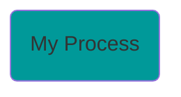
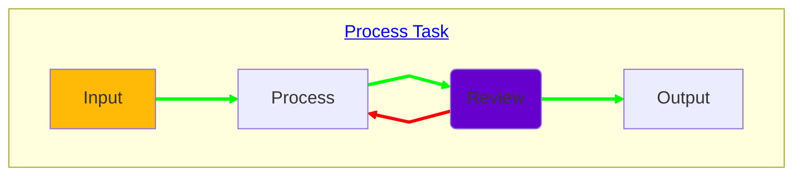

### Process Task

Une `Process Task` représente la boucle itérative d'un `Process` et de sa `Review`.  
Le `Process` est effectuée puis `Review` par le(s) responsable(s) attitré à la `Process Task`.
Si la `Process Task` est **validée** alors le workflow continue vers l'étape suivante, dans le cas contraire celui-ci retourne en `Process` et la boucle est réitérée jusqu'à validation.

