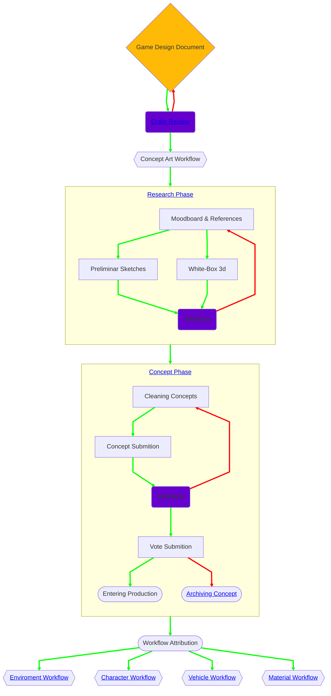

## Workflow - Research & Concept Art

---

### Order Review
#### Review et validation
Cette phase la première par laquelle passent toutes les commandes de l'équipe Art.  
Elle commence par la réception du Game Design Document issue de la phase de Design Préliminaire faite par les différentes équipes concernées.
À la réception du GDD, le Directeur Artistique et les Art Leads concernés effectuent une contre-review de celui-ci pour s'assurer qu'aucun élément n'est manquant (cette phase de review a normalement déjà été effectuée avant la validation du GDD et son entrée en production).

#### Analyse technique et évaluation de la difficulté
En parallèle de la validation du GDD, une évaluation des différents process à mettre en oeuvre ainsi qu'une analyse de la difficulté globale pour la réalisation de celui-ci sont faites.  
Elles permettent de rendre compte de la complexité et de lister les connaissances et compétences nécessaires afin d'attribuer les différentes tâches aux équipes les plus adaptées à leur réalisation.

#### Création d'une tâche sur le GitHub-Project
Suite aux deux phases précédentes, le Directeur Artistique et les Art Leads sont à même de créer la ou les tâches relatives au GDD sur l'espace [Creative Concept](https://github.com/orgs/DyingStar-game/projects/16) du GitHub Project.  
C'est via ces tâches que les différents contributeurs seront assignés à la réalisation de la commande.
Elles servent à garder une traçabilité de l'avancement celles-ci et une vision globale des commandes en cours pour le département Art. Elles sont également intégrées au GitHub Project global afin d'avoir une vue d'ensemble de l'avancement du projet.

#### Ouverture d'un fil de suivit sur le serveur Discord
Après la création d'une tâche sur le GitHub-Project, un fil de suivit assigné à celle-ci est également ouvert sur le serveur Discord. Ce fil de suivit sert d'espace de communication dédié à la réalisation de cette tâche, il permet de centraliser les échanges relatifs à celle-ci pour les différents contributeurs.

#### Création d'un espace dédié sur Figma
En même temps que l'ouverture du fil de suivit sur le serveur Discord, un espace de travail et de partage est également ouvert sur le [Figma Art](https://www.figma.com/board/Gx0wKhuzI7nKSPpLmn6IvG/3D-Modeling-Team).  
Celui-ci servira pour les différentes étapes de production de la commande reçue jusqu'à ce qu'elle soit archivée.
Les références, recherches, concepts, avancement, retours, ... seront centralisés sur cet espace afin de garder les informations importantes accessibles facilement en parcourant celui-ci.

---

### Research Phase
#### Moodboard & References
Durant cette phase, les différents contributeurs au projet (département Art et autres départements) peuvent proposer des références qui serviront aux équipes artistiques lors des étapes de production suivantes.

- **Références** : Servent à l'analyse et à la compréhension d'un sujet réel ou précis en se focalisant sur des aspects concrets (forme, matière, détails, mécanique, ...).  
Exemple: *Photos de métal rouillé pour une texture*
- **Moodboard** : Définit une vision artistique et émotionnelle comme une ambiance, un style, une identité visuelle.  
Exemple: *Images brumeuses, bleues et froide pour définir l'atmosphère d'un niveau*

#### Preliminar Designs
À partir des références et moodbards établis précédemment, des concept préliminaires doivent être réalisés.  Ceux-ci doivent traiter du sujet sans entrer dans le détail en se focalisant principalement sur la silhouette, les volumes et la composition afin de proposer des idées générales qui seront ensuite rafinées ou utilisées comme références lors de la phase suivante.  
Le choix du médium est libre et dépend des affinités de chacun.

#### Validation
Lors de cette phase de validation, le Directeur Artistique et les Art Leads passent en revue le résultats des deux étapes précédentes (**Moodboard & References** et **Preliminar Designs**).  
Sont évalués ici la pertinence des propositions de références, de moodboards et de designs par rapport au sujet traité.
L'objectif ici est de retenir un maximum de propositions et de les rassembler à partir de points communs entre elles afin d'obtenir des idées générales à développer plus en détails dans la phase suivante.

---

### Concept Phase
#### Cleaning Concepts
La phase mise au propre conciste à reprendre les propositions de design faites lors de la phase précédente en y ajoutant cette fois plus de détails et de profondeur.  
L'objectif cette fois ci est d'obtenir un concept visuellement aboutis pouvant servir de référence principale lors des étapes de production à venir.

#### Concept Submition
Cette étape prépare le concept à sa validation.  
Celui-ci doit être adapté aux standards des propositions en terme de visuels et d'informations techniques.
Un template est fournis afin de s'assurer que tout les éléments obligatoires soient fournis lors du passage à la validation.

#### Validation
Lors de l'étape de validation, le Directeur Artistique et les Art Leads vérifient que les différents points du Game Design Document sont respectés dans la proposition de concept.  
- Si un concept **est validé**, il est alors ajouté à ceux qui seront proposés ultérieurement lors du choix du (ou des) concept(s) qui entreront en production.
- Si un concept **n'est pas validé**, celui-ci fait l'objet de retours de la part du Directeur Artistique et des Art Leads afin que le contributeur l'ayant soumis puisse faire les ajustements nécessaire avant de le soumettre à nouveau.  
Le concept retourne alors en phase de mise au propre.

#### Sélection Finale
C'est lors de cette phase qu'est décidé si un concept continuera en production ou non.  
En fonction de l'importance de la commande, le processus de décision peut varier:

| Importance    | Processus de décision                                   | Exemple                      |
| ------------- | ------------------------------------------------------- | ---------------------------- |
| Majeure       | Soumis au vote de tout les contributeurs                | Concept d'un véhicule        |
| Intermédiaire | Soumis au vote des contributeurs du département Art     | Concept d'un bâtiment divers |
| Mineure       | Soumis au vote du Directeur Artistique et des Art Leads | Concept de props divers      |

Les concepts **non votés** sont quand à eux archivés pour garder une trace des contributions de chacun, mais aussi car elle peuvent servir à nouveau si une nouvelle commande est ouverte pour des variantes d'un asset déjà existant.  
Les concepts **votés** entrent en production et continuent vers la pipeline adéquate:
- [Environment Pipeline](.?workflow-tabs=Environment)
- [Character Pipeline](.?workflow-tabs=Character)
- [Vehicle Pipeline](.?workflow-tabs=Vehicle)
- [Material Pipeline](.?workflow-tabs=Material)