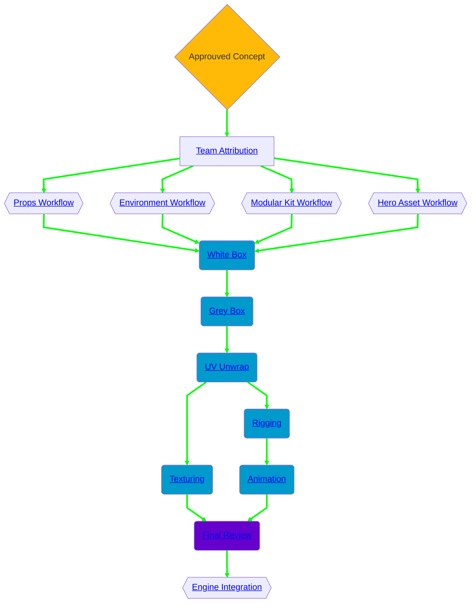

import ProcessTask from './_processTask.mermaid.mdx'

## Workflow - Environment Team

---

    
Legende

    <ProcessTask name="process-task"/>

### Team Attribution
Lors de cette phase, deux possibilités existent:
- Une équipe (un ou plusieurs contributeurs) est assignée en fonction de la complexité et de la difficulté évaluée lors des phases précédentes.
- Une équipe (un ou plusieurs contributeurs) s'assigne d'elle même à une tâche libre. Dans ce cas là, c'est à l'équipe d'évaluer objectivement sa capacité à réaliser la tâche.

---

### Workflow Attribution
Plusieurs worklows éxistent en fonction du type d'asset à réaliser.
Le choix du workflow dépend de la complexité et du / des asset(s) à réaliser, du leur rôle au seins du projet et des différents acteurs devant intervenir lors de sa production.
Les étapes de production restent sensiblement les mêmes, mais leur réalisation et les contraintes s'y appliquant peuvent varier d'un workflow à un autre.

| Terme                   | Fonction                                       | Niveau d’importance           | Réutilisabilité | Complexité    |
| ----------------------- | ---------------------------------------------- | ----------------------------- | --------------- | ------------- |
| **Props**               | Petits objets décoratifs                       | Faible → moyenne              | Faible          | Simple        |
| **Environnement Asset** | Élément structurel ou décorant l’environnement | Moyenne → élevée              | Moyenne         | Variable      |
| **Modular Kit**         | Ensemble d’éléments standardisés combinables   | Élevée (structure du monde)   | Très élevée     | Moyen         |
| **Hero Asset**          | Objet clé, focalisateur, très détaillé         | Très élevée (visuel narratif) | Faible          | Très complexe |

#### Props Workflow
C'est le workflow le léger à mettre en oeuvre.  
Petits objets placés dans la scène pour enrichir l’environnement, raconter une histoire, rendre un lieu plus crédible ou donner un sens visuel.
Ils sont généralement de petite taille, réutilisable, ne participent pas à la structure du décor et leur niveau de détail varie en fonction de leur taille et de leur distance d'observation.
Exemples:
- Chaise, bouteille, lampe, caisse
- Débris, outils, accessoirs divers

#### Environment Workflow
La difficulté de ce type de workflow varie d'un asset à un autre, mais reste généralement modéré.
Un asset d’environnement est un élément qui fait partie du décor ou qui définit la géographie/architecture d’une zone.
Il joue un rôle structurel dans la scène en contribuant à sa composition ou à sa silhouette, il peut être de petite ou grande taille mais généralement plus massif qu'un simple prop, il est souvent moins réutilisable d'un modular kit.
Exemples:
- Un rocher, un arbre, un pont
- Une falaise

#### Modular Kit Workflow

#### Hero Asset Workflow

---
### Process Steps
#### White Box
#### Grey Box
#### UV Unwrap
#### Texturing
#### Rigging
#### Animation

---

### Final Review

---

### Engine Integration