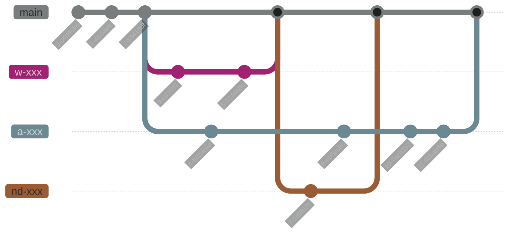

# Technical Doc Workflow

## Workflow Logic

### Branch Creation

To add documentation, create a new branch from `main`. Each branch should follow the naming convention:

**Format**: `{teamAcronym}-{conciseAndSpecificName}`

**Examples of team acronyms**:

- `w-` for Web
- `a-` for Audio
- `nd-` for Narrative Design

**Examples**: `w-addAuthApi`, `a-mixingGuide`, `nd-dialogSystem`

### Contribution Process

1. **Create and document**: Create your branch, add your documentation, and commit your changes.

2. **Pull Request**: Once your work is done, open a Pull Request (PR) to `main`.

3. **Automatic CI**: The PR automatically triggers a CI that:

   - Checks the documentation validity
   - Tests links to ensure they work

4. **Review**: The PR must be validated by a **Lead** or **Sub-Lead** from the relevant team.

5. **Merge and Deployment**: Once approved and merged into `main`, a new version of the site is automatically deployed.
